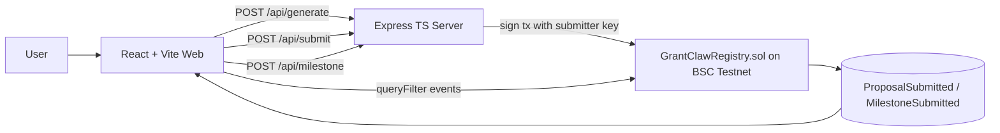

# GrantClaw Lite MVP

**GrantClaw Lite MVP: proposal + milestone proofs on BSC testnet**

## 30s pitch
GrantClaw makes grant execution transparent by anchoring proposals and milestone proofs onchain. Teams generate deterministic proposal JSON, hash it, submit hash+metadata to BNB Testnet, and then append milestone hashes over time. Judges can verify exact documents and audit progress through event timelines in a clean, reproducible demo.

## Architecture


## Repository structure
```
grantclaw-lite/
  contracts/
  scripts/
  test/
  server/
  web/
  package.json
  hardhat.config.ts
  tsconfig.json
  README.md
```

## Setup from zero
1. **Install dependencies**
   ```bash
   cd grantclaw-lite
   npm run install:all
   ```
2. **Configure server env**
   ```bash
   cp server/env.example server/.env
   ```
   Fill:
   - `BSC_TESTNET_RPC`
   - `DEPLOYER_PRIVATE_KEY` (used for deploy via hardhat)
   - `SUBMITTER_PRIVATE_KEY` (server signer for submit/milestone)
   - `REGISTRY_ADDRESS` (after deploy)
   - `PORT` (default `8080`)
3. **Deploy contract to BSC testnet**
   ```bash
   npm run deploy:testnet
   ```
   Copy deployed address into `server/.env` as `REGISTRY_ADDRESS`.
4. **Configure web env**
   ```bash
   cp web/env.example web/.env.local
   ```
   Fill:
   - `VITE_API_BASE=http://localhost:8080`
   - `VITE_BSC_TESTNET_RPC`
   - `VITE_REGISTRY_ADDRESS`
   - `VITE_EVENT_LOOKBACK_BLOCKS=200000`
5. **Run tests**
   ```bash
   npx hardhat test
   ```
6. **Run app (server + web)**
   ```bash
   npm run dev
   ```
   - Web: `http://localhost:5173`
   - API: `http://localhost:8080`

## 2-minute demo script
1. Open `/generate`, enter grant + project details, click **Generate**.
2. On `/preview`, show deterministic JSON and proposal hash. Click **Download JSON**.
3. Go to `/submit`, submit proposal onchain, open BscScan tx link.
4. Open proposal detail page (`/p/:hash`) and show proposal metadata.
5. Submit a milestone from the milestone form.
6. Refresh timeline and show new milestone event appended in order.
7. Open `/feed` and show proposal list coming from onchain events.

## Acceptance checklist
- [x] Deterministic proposal JSON generation + keccak256 hash via backend.
- [x] `POST /api/submit` signs and sends `submitProposal` transaction.
- [x] `POST /api/milestone` builds deterministic milestone JSON, hashes it, submits onchain.
- [x] Contract dedups milestones per proposal and emits required events.
- [x] Frontend flow: generate → preview → submit → proposal detail + milestones.
- [x] Feed page reads events using `queryFilter` in a lookback block range.
- [x] BscScan testnet links for transaction visibility.
- [x] Hardhat tests for proposal + milestone success and revert paths.
- [x] Convenience scripts for install/dev/deploy.
- [x] No secrets committed.

## AI Build Log
- **What AI does:** during `POST /api/generate`, the server asks an AI judge assistant to summarize the proposal, score feasibility (0-100), classify risk (`Low`/`Medium`/`High`), and suggest exactly 3 milestone ideas with measurable KPIs.
- **Prompt style used:** `server/src/ai.ts` sends a strict instruction to return JSON only, using an exact schema (`summary`, `score`, `risk`, and `suggestedMilestones[3]` with `title/description/kpi`) and no extra keys or markdown.
- **Safety + source of truth:** if `OPENAI_API_KEY` is missing or OpenAI fails/times out, generation still returns the deterministic proposal + hash with a deterministic AI-lite evaluation. Onchain proposal/milestone events remain the source of truth; AI output is advisory only.

## Deploy on Vercel (frontend + backend as one app)
This repo now supports a single-project Vercel deployment with Vite frontend and serverless `/api/*` functions.

### Environment variables on Vercel
Set these **Server-side / API** env vars:
- `BSC_TESTNET_RPC`
- `SUBMITTER_PRIVATE_KEY`
- `REGISTRY_ADDRESS`
- `OPENAI_API_KEY` (optional)

Set these **Frontend (Vite)** env vars:
- `VITE_BSC_TESTNET_RPC`
- `VITE_REGISTRY_ADDRESS`
- `VITE_EVENT_LOOKBACK_BLOCKS`
- `VITE_REGISTRY_START_BLOCK` (optional)
- `VITE_API_BASE` (optional; leave empty for same-origin `/api` calls)

### Redeploy steps
1. Push your branch to GitHub.
2. In Vercel, import the repo (or trigger redeploy on existing project).
3. Confirm env vars above are configured for the target environment.
4. Redeploy.
5. Smoke test:
   - App loads (no HTML/JSON mismatch errors)
   - `GET /api/grants` returns JSON
   - `POST /api/generate` returns JSON (with AI evaluation or deterministic fallback)
